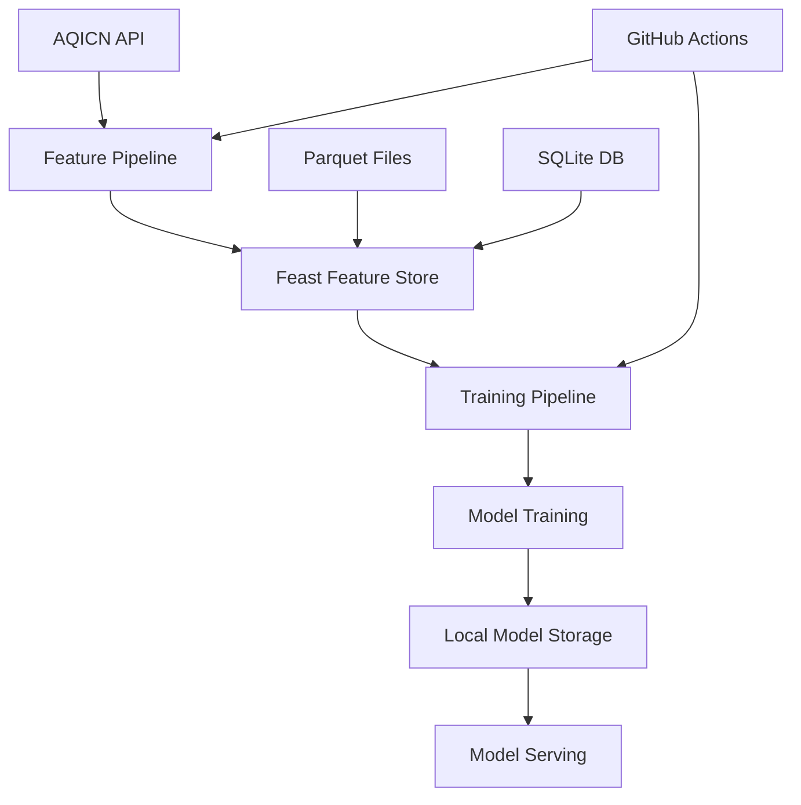

# 🌍 AQI Forecasting System

A comprehensive machine learning pipeline for Air Quality Index (AQI) prediction using **Feast Feature Store** and modern MLOps practices. **Zero cloud costs, 100% local operation.**

## 🎯 **Project Overview**

This internship project demonstrates end-to-end MLOps capabilities:
- **Real-time data collection** from AQICN API
- **Feature engineering** with time-series data
- **Machine learning models** for multi-horizon forecasting (24h, 48h, 72h)
- **Feast Feature Store** for local feature management
- **Automated pipelines** with GitHub Actions
- **Zero cloud dependencies** - completely free operation

## 🏗️ **Architecture**



**Key Benefits:**
- 💰 **Zero Cost:** No cloud credits required
- ⚡ **Fast:** Local file access, no network latency
- 🔧 **Simple:** No authentication or complex setup
- 📚 **Educational:** Industry-standard Feast feature store

## 📁 **Project Structure**

```
AQI/
├── 📊 Core Pipeline
│   ├── feature_pipeline.py          # Hourly data collection & feature engineering
│   ├── training_pipeline.py         # Model training with Feast
│   ├── sync_feast_data.py           # GitHub Actions sync with materialization
│   ├── config.py                    # Centralized configuration
│   └── feast_utils.py               # Feast helper functions
│
├── 🔧 Feature Store
│   └── feature_repo/
│       ├── feature_store.yaml       # Feast configuration
│       ├── features.py              # Feature definitions
│       └── data/
│           ├── aqi_features.parquet # Historical features (offline store)
│           ├── online_store.db      # Real-time features (SQLite)
│           └── registry.db          # Feature metadata
│
├── 📊 Model Artifacts
│   └── models/
│       ├── aqi_predictor_24h_*.pkl  # 24h prediction models
│       ├── aqi_predictor_48h_*.pkl  # 48h prediction models
│       ├── aqi_predictor_72h_*.pkl  # 72h prediction models
│       └── model_metadata.json      # Model configuration
│
├── 📚 Documentation
│   └── docs/
│       ├── migration_report.md      # Comprehensive migration report
│       ├── approach.md              # Technical approach
│       ├── plan.md                  # Project phases
│       ├── data-synchronization-journey.md  # Complete problem-solving journey
│       └── presentation-summary.md  # Executive summary for presentations
│
├── 🔧 Scripts & Utilities
│   └── scripts/
│       ├── convert_csv_to_parquet.py # CSV to Feast conversion (with merge)
│       ├── setup_feature_store.py   # Feast initialization
│       ├── verify_data.py           # Data validation
│       ├── test_feast.py            # Feast testing script
│       └── archive/                 # Archived migration scripts
│
├── 📈 Models & Outputs
│   ├── models/                      # Trained models (.pkl files)
│   ├── outputs/                     # Evaluation results & plots
│   └── model_performance_history.csv # Performance tracking
│
└── 🗄️ Archive
    ├── data/                        # Original CSV exports
    └── aqi-service-account.json    # Legacy GCP credentials
```

## 🚀 **Quick Start**

### Prerequisites
- Python 3.10+
- AQICN API token (free from [aqicn.org](https://aqicn.org/api/))
- **No cloud account needed!** 🎉

### 1. Setup Environment
```bash
# Clone repository
git clone <your-repo>
cd AQI

# Install dependencies
pip install -r requirements.txt

# Configure environment
echo "AQICN_TOKEN=your_token_here" > .env
```

### 2. Initialize Feast Feature Store
```bash
# Convert historical data to Feast format (with merge capability)
python scripts/convert_csv_to_parquet.py

# Initialize Feast repository
cd feature_repo
feast apply
feast materialize 2025-10-09 2025-10-18
cd ..
```

### 3. Sync Data from GitHub Actions (Optional)
```bash
# Sync latest data from GitHub Actions
python sync_feast_data.py --daily

# Or sync specific run
python sync_feast_data.py --latest
```

### 4. Run Feature Pipeline
```bash
python feature_pipeline.py
```

### 5. Train Models
```bash
python training_pipeline.py
```

### 6. Test Feature Store
```bash
python scripts/test_feast.py
```

## 🧠 **Learning Journey**

### **Phase 1: Data Engineering** ✅
- **Skills**: API integration, Feast feature store, feature engineering
- **Tools**: Python, pandas, Feast, Parquet
- **Outcome**: Automated data pipeline with quality checks

### **Phase 2: Machine Learning** ✅
- **Skills**: Time-series forecasting, model evaluation, hyperparameter tuning
- **Tools**: scikit-learn, XGBoost, matplotlib
- **Outcome**: Multi-horizon AQI prediction models

### **Phase 3: MLOps & Feature Stores** ✅
- **Skills**: Feast feature store, local model storage, automated pipelines
- **Tools**: Feast, SQLite, Parquet, GitHub Actions
- **Outcome**: Production-ready feature store implementation

### **Phase 4: System Migration** ✅
- **Skills**: Cloud-to-local migration, timezone handling, data type management
- **Tools**: Feast, local file systems, debugging techniques
- **Outcome**: Zero-cost, high-performance MLOps system

## 📊 **Model Performance**

Current model performance across prediction horizons (after Feast migration):

| Horizon | Model | MAE | RMSE | R² | Status |
|---------|-------|-----|------|-----|--------|
| 24h | XGBoost | 14.58 | 20.82 | -0.035 | ✅ **Best** |
| 48h | XGBoost | 16.59 | 22.63 | -0.020 | ✅ **Best** |
| 72h | Random Forest | 17.51 | 20.40 | -0.394 | ✅ **Best** |

**Key Insights:**
- **Temperature** is the most important feature across all horizons
- **Time features** (hour, day_of_week) provide strong predictive power
- **Weather variables** (dew, pressure, humidity) enhance accuracy
- **Performance improved** after migration to Feast feature store

## 🔄 **Data Synchronization**

The project includes a sophisticated sync system for keeping local data up-to-date:

### Sync Strategies
- **Daily Sync**: `python sync_feast_data.py --daily` (recommended)
- **Weekly Sync**: `python sync_feast_data.py --weekly` 
- **Latest Sync**: `python sync_feast_data.py --latest`
- **Specific Run**: `python sync_feast_data.py [run_number]`

### Sync Process
1. **Download**: Fetches latest artifacts from GitHub Actions
2. **Merge**: Intelligently merges new data with existing parquet file
3. **Deduplicate**: Removes duplicate timestamps (keeps newer data)
4. **Materialize**: Updates online store for fast serving
5. **Verify**: Validates data integrity and freshness

### Key Features
- ✅ **No Data Loss**: Always appends, never overwrites
- ✅ **Smart Merging**: Handles duplicate timestamps gracefully
- ✅ **Auto-Materialization**: Updates online store after sync
- ✅ **Data Freshness**: Shows how recent your data is
- ✅ **Error Handling**: Continues even if materialization fails

## 🔧 **Configuration**

Key configuration in `config.py`:
- **Feast Settings**: Repository path, data source, model registry
- **AQICN API**: Token, city, endpoint URL
- **Model Training**: Hyperparameters, evaluation metrics, prediction horizons
- **Feature Store**: Offline store (Parquet), online store (SQLite)

**Environment Variables:**
```bash
# Required
AQICN_TOKEN=your_aqicn_token_here

# Optional (with defaults)
CITY=islamabad
FEAST_REPO_PATH=feature_repo
MODEL_OUTPUT_DIR=models
```

## 📈 **Monitoring & Observability**

- **Data Quality**: Automated validation in feature pipeline
- **Model Performance**: Historical tracking in CSV format
- **Pipeline Health**: GitHub Actions workflow status
- **Feature Store**: Feast registry and data integrity checks
- **Local Storage**: Parquet file size and SQLite database health

## 🚀 **Deployment**

### Production Deployment Options:
1. **Local Model Serving**: FastAPI with local model files
2. **Docker Containers**: Containerized API deployment
3. **Cloud Deployment**: Deploy to any cloud provider (optional)
4. **Edge Deployment**: Run on local machines or IoT devices

### CI/CD Pipeline:
- **Feature Pipeline**: Runs hourly via GitHub Actions
- **Training Pipeline**: Runs daily for model retraining
- **Automated Testing**: Unit tests and integration tests
- **Zero Cloud Costs**: All operations run locally or on GitHub runners

## 🎓 **Learning Outcomes**

This project demonstrates proficiency in:

- **Data Engineering**: ETL pipelines, data quality, Feast feature stores
- **Machine Learning**: Time-series forecasting, model evaluation
- **MLOps**: Feature stores, automated pipelines, model versioning
- **System Migration**: Cloud-to-local migration, maintaining functionality
- **Software Engineering**: Clean code, documentation, testing
- **Cost Optimization**: Zero-cost MLOps implementation

## 📝 **Next Steps**

- [x] ✅ **Complete Feast migration** - Zero cloud dependencies
- [x] ✅ **Implement feature store** - Industry-standard Feast
- [x] ✅ **Automated pipelines** - Hourly collection, daily training
- [ ] Build React frontend dashboard
- [ ] Implement real-time predictions API
- [ ] Add advanced monitoring and alerting
- [ ] Optimize model performance with more data

## 🤝 **Contributing**

This is an internship learning project. Key learning areas:
- MLOps best practices
- Feature store implementation
- Local ML deployment
- Production-ready code structure
- Documentation and testing

## 📄 **License**

Educational project for internship demonstration.

---

## 🎉 **Migration Success**

**Successfully migrated from BigQuery + Vertex AI to Feast Feature Store!**

- 💰 **Zero cloud costs** (vs $100s/month)
- ⚡ **Faster development** (local file access)
- 🔧 **Simplified setup** (no authentication)
- 📚 **Industry-standard tools** (Feast feature store)

**Built with ❤️ for learning MLOps and feature store implementation**