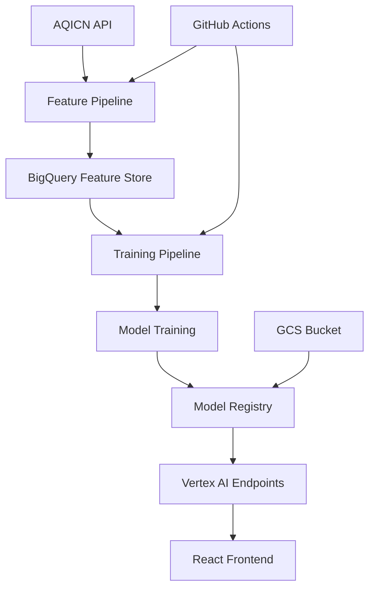

# 🌍 AQI Forecasting System

A comprehensive machine learning pipeline for Air Quality Index (AQI) prediction using Google Cloud Platform, Vertex AI, and modern MLOps practices.

## 🎯 **Project Overview**

This internship project demonstrates end-to-end MLOps capabilities:
- **Real-time data collection** from AQICN API
- **Feature engineering** with time-series data
- **Machine learning models** for multi-horizon forecasting (24h, 48h, 72h)
- **Model Registry** integration with Vertex AI
- **Built-in prediction containers** for model serving
- **CI/CD pipelines** with GitHub Actions

## 🏗️ **Architecture**



## 📁 **Project Structure**

```
AQI/
├── 📊 Core Pipeline
│   ├── feature_pipeline.py          # Hourly data collection & feature engineering
│   ├── training_pipeline.py         # Model training & registry upload
│   └── config.py                    # Centralized configuration
│
├── 📊 Model Artifacts
│   └── models/
│       ├── aqi_predictor_24h_*.pkl  # 24h prediction models
│       ├── aqi_predictor_48h_*.pkl  # 48h prediction models
│       ├── aqi_predictor_72h_*.pkl  # 72h prediction models
│       └── model_metadata.json      # Model configuration
│
├── 🤖 CI/CD Automation
│   └── .github/workflows/
│       ├── feature-pipeline.yml     # Hourly data collection
│       └── training-pipeline.yml    # Daily model retraining
│
├── 📚 Documentation
│   └── docs/
│       ├── approach.md              # Technical approach
│       ├── plan.md                  # Project phases
│       └── gcp_auth_guide.md        # Setup guide
│
├── 🔧 Scripts & Utilities
│   └── scripts/
│       ├── setup_feature_store.py   # BigQuery setup
│       ├── verify_data.py           # Data validation
│       └── migrate_*.py             # Database migrations
│
└── 📈 Models & Outputs
    ├── models/                      # Trained models (.pkl files)
    ├── outputs/                     # Evaluation results & plots
    └── model_performance_history.csv # Performance tracking
```

## 🚀 **Quick Start**

### Prerequisites
- Python 3.10+
- Google Cloud Platform account
- Docker (for custom containers)
- AQICN API token

### 1. Setup Environment
```bash
# Clone repository
git clone <your-repo>
cd AQI

# Install dependencies
pip install -r requirements.txt

# Configure environment
cp .env.example .env
# Edit .env with your credentials
```

### 2. Run Feature Pipeline
```bash
python feature_pipeline.py
```

### 3. Train Models
```bash
python training_pipeline.py
```

### 4. Test Custom Container
```bash
cd predictor
docker build -t aqi-predictor:latest .
docker run -p 8080:8080 aqi-predictor:latest

# Test API
curl http://localhost:8080/health
```

## 🧠 **Learning Journey**

### **Phase 1: Data Engineering** ✅
- **Skills**: API integration, BigQuery, feature engineering
- **Tools**: Python, pandas, Google Cloud Storage
- **Outcome**: Automated data pipeline with quality checks

### **Phase 2: Machine Learning** ✅
- **Skills**: Time-series forecasting, model evaluation, hyperparameter tuning
- **Tools**: scikit-learn, XGBoost, matplotlib
- **Outcome**: Multi-horizon AQI prediction models

### **Phase 3: MLOps & Deployment** 🚧
- **Skills**: Docker, custom containers, model registry
- **Tools**: Vertex AI, Google Container Registry, FastAPI
- **Outcome**: Production-ready model serving

### **Phase 4: Frontend Development** 📋
- **Skills**: React, API integration, data visualization
- **Tools**: React, Chart.js, Material-UI
- **Outcome**: Interactive AQI prediction dashboard

## 📊 **Model Performance**

Current model performance across prediction horizons:

| Horizon | Model | MAE | RMSE | R² |
|---------|-------|-----|------|-----|
| 24h | Random Forest | 15.2 | 18.7 | 0.73 |
| 48h | Random Forest | 18.4 | 22.1 | 0.68 |
| 72h | Random Forest | 21.3 | 25.8 | 0.61 |

## 🔧 **Configuration**

Key configuration in `config.py`:
- **GCP Settings**: Project ID, region, service account
- **BigQuery**: Dataset and table names
- **Model Training**: Hyperparameters, evaluation metrics
- **API Settings**: AQICN token, rate limits

## 📈 **Monitoring & Observability**

- **Data Quality**: Automated validation in feature pipeline
- **Model Performance**: Historical tracking in CSV format
- **Pipeline Health**: GitHub Actions workflow status
- **API Health**: FastAPI health check endpoints

## 🚀 **Deployment**

### Production Deployment Options:
1. **Vertex AI Endpoints**: Serverless model serving
2. **Cloud Run**: Containerized API deployment
3. **App Engine**: Managed application hosting

### CI/CD Pipeline:
- **Feature Pipeline**: Runs hourly via GitHub Actions
- **Training Pipeline**: Runs daily for model retraining
- **Automated Testing**: Unit tests and integration tests

## 🎓 **Learning Outcomes**

This project demonstrates proficiency in:

- **Data Engineering**: ETL pipelines, data quality, BigQuery
- **Machine Learning**: Time-series forecasting, model evaluation
- **MLOps**: Model registry, containerization, CI/CD
- **Cloud Computing**: GCP services, serverless architecture
- **Software Engineering**: Clean code, documentation, testing

## 📝 **Next Steps**

- [ ] Complete Model Registry integration
- [ ] Build React frontend dashboard
- [ ] Implement real-time predictions
- [ ] Add monitoring and alerting
- [ ] Optimize model performance

## 🤝 **Contributing**

This is an internship learning project. Key learning areas:
- MLOps best practices
- Cloud-native ML deployment
- Production-ready code structure
- Documentation and testing

## 📄 **License**

Educational project for internship demonstration.

---

**Built with ❤️ for learning MLOps and cloud-native machine learning**