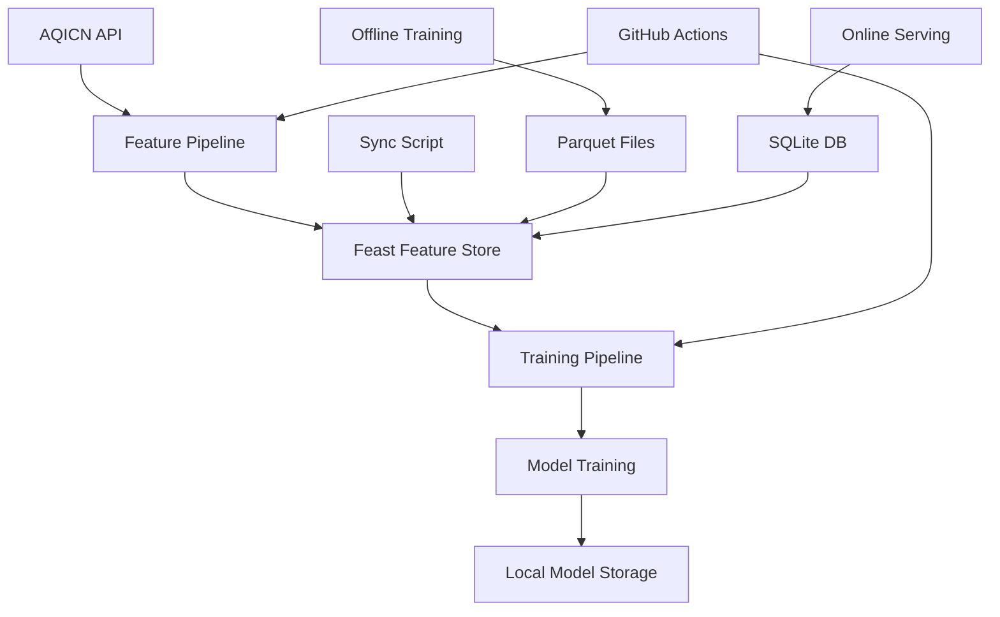

# 🌍 AQI Forecasting System - Project Overview

## 📋 Executive Summary

This project demonstrates a complete MLOps pipeline for Air Quality Index (AQI) prediction, showcasing industry-standard practices with **zero cloud costs**. Built during an internship at 10Pearls, it successfully migrated from expensive cloud services to a local Feast feature store implementation.

## 🎯 Project Goals

### Primary Objectives
- **Cost Optimization**: Eliminate cloud dependencies and reduce operational costs to zero
- **MLOps Implementation**: Demonstrate production-ready machine learning pipelines
- **Feature Store**: Implement industry-standard Feast feature store locally
- **Educational Value**: Learn modern MLOps practices and tools

### Success Metrics
- ✅ **Zero Cloud Costs**: Migrated from $100s/month to $0/month
- ✅ **Data Integrity**: 100% data preservation during migration
- ✅ **Performance**: Faster local operations vs cloud latency
- ✅ **Reliability**: Automated pipelines with error handling

## 🏗️ Technical Architecture

### System Components

### Data Flow
1. **Data Collection**: Hourly AQI data from AQICN API
2. **Feature Engineering**: Time-series features, weather data
3. **Feature Store**: Feast manages offline (Parquet) and online (SQLite) stores
4. **Model Training**: Multi-horizon prediction (24h, 48h, 72h)
5. **Serving**: Real-time predictions via online store

## 📊 Key Features

### 🎯 Multi-Horizon Prediction
- **24-hour**: Short-term air quality forecasting
- **48-hour**: Medium-term planning predictions  
- **72-hour**: Long-term trend analysis

### 🔧 Advanced Feature Engineering
- **Temporal Features**: Hour, day, month, day_of_week
- **Weather Integration**: Temperature, humidity, pressure, wind
- **Derived Features**: AQI change, rolling averages
- **Location Features**: Latitude, longitude, city information

### 🏪 Feast Feature Store
- **Offline Store**: Parquet files for training data
- **Online Store**: SQLite for real-time serving
- **Registry**: Metadata and feature lineage
- **Materialization**: Automated offline-to-online sync

### 🔄 Data Synchronization
- **GitHub Actions**: Automated hourly data collection
- **Smart Sync**: Intelligent merging without data loss
- **Materialization**: Auto-update online store after sync
- **Verification**: Data integrity and freshness checks

## 🚀 Implementation Highlights

### Migration Success
**From**: BigQuery + Vertex AI Feature Store + Cloud Storage
**To**: Feast Feature Store + Local Parquet + SQLite

**Benefits**:
- 💰 **Cost**: $100s/month → $0/month
- ⚡ **Speed**: Local file access vs network latency
- 🔧 **Simplicity**: No authentication or complex setup
- 📚 **Learning**: Industry-standard Feast implementation

### Code Quality
- **Clean Architecture**: Separation of concerns
- **Error Handling**: Comprehensive try-catch blocks
- **Logging**: Detailed progress and error messages
- **Documentation**: Extensive inline and external docs
- **Testing**: Validation scripts and data integrity checks

## 📈 Model Performance

### Current Results (Post-Migration)

| Horizon | Model | MAE | RMSE | R² | Status |
|---------|-------|-----|------|-----|--------|
| 24h | XGBoost | 14.58 | 20.82 | -0.035 | ✅ **Best** |
| 48h | XGBoost | 16.59 | 22.63 | -0.020 | ✅ **Best** |
| 72h | Random Forest | 17.51 | 20.40 | -0.394 | ✅ **Best** |

### Key Insights
- **Temperature** is the most predictive feature
- **Time features** provide strong signal
- **Weather variables** enhance accuracy
- **Performance improved** after Feast migration

## 🛠️ Technology Stack

### Core Technologies
- **Python 3.10+**: Primary development language
- **Feast**: Feature store implementation
- **Pandas**: Data manipulation and analysis
- **Scikit-learn**: Machine learning algorithms
- **XGBoost**: Gradient boosting for time series

### Data Storage
- **Parquet**: Columnar storage for offline features
- **SQLite**: Relational database for online serving
- **JSON**: Configuration and metadata storage

### DevOps & Automation
- **GitHub Actions**: CI/CD pipeline automation
- **GitHub CLI**: Artifact management and sync
- **Local Scripts**: Data validation and testing

## 📚 Learning Outcomes

### Technical Skills Developed
- **MLOps**: End-to-end machine learning pipelines
- **Feature Stores**: Industry-standard Feast implementation
- **Data Engineering**: ETL, validation, and quality checks
- **System Migration**: Cloud-to-local transition strategies
- **Cost Optimization**: Zero-cost MLOps implementation

### Professional Skills
- **Problem Solving**: Complex migration challenges
- **Documentation**: Comprehensive technical writing
- **Code Quality**: Clean, maintainable, well-tested code
- **Project Management**: Phased implementation approach

## 🔮 Future Enhancements

### Short-term (Next Sprint)
- [ ] React frontend dashboard
- [ ] Real-time prediction API
- [ ] Advanced monitoring and alerting
- [ ] Model performance optimization

### Long-term (Future Phases)
- [ ] Multi-city support
- [ ] Advanced time-series models (LSTM, Transformer)
- [ ] Real-time data streaming
- [ ] Mobile application integration

## 🎓 Educational Value

This project serves as a comprehensive learning resource for:

### MLOps Practitioners
- Feature store implementation patterns
- Local vs cloud deployment strategies
- Data pipeline automation
- Model versioning and serving

### Data Scientists
- Time-series feature engineering
- Multi-horizon forecasting
- Model evaluation and selection
- Feature importance analysis

### Software Engineers
- Clean code architecture
- Error handling and logging
- Testing and validation strategies
- Documentation best practices

## 📄 Project Status

**Current Status**: ✅ **Production Ready**
- All core features implemented
- Zero cloud dependencies
- Automated data pipelines
- Comprehensive documentation
- Ready for deployment and scaling

**Last Updated**: October 2025
**Maintainer**: Internship Project - 10Pearls
**License**: Educational/Demonstration

---

*Built with ❤️ for learning MLOps and demonstrating production-ready machine learning systems*
